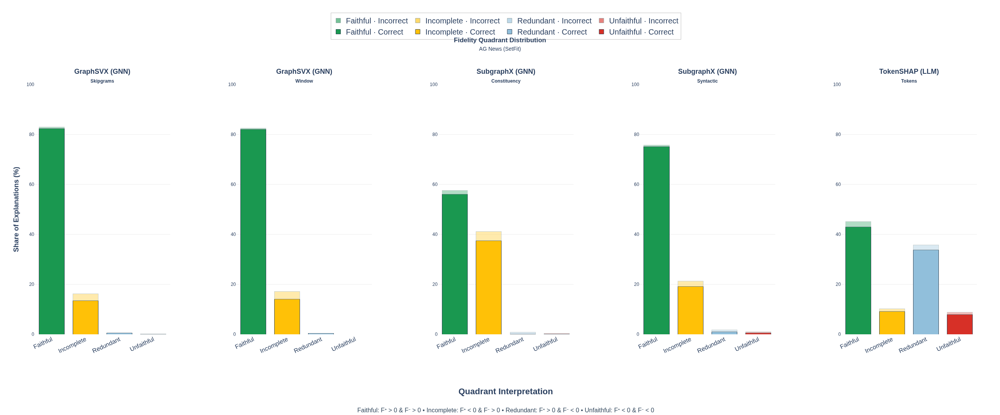
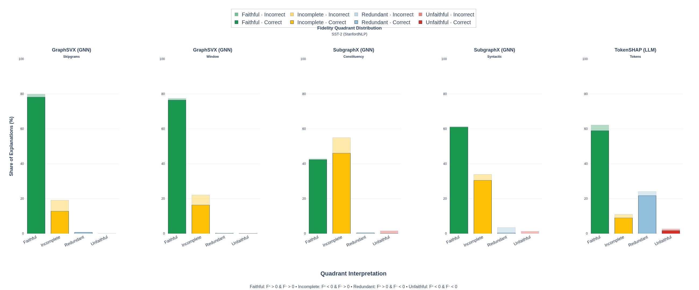

# Graph Neural Networks Enable Superior Error Detection in NLP Explainability than Language Models

Official code repository for the paper *"Graph Neural Networks Enable Superior Error Detection in NLP Explainability than Language Models"*.

---

## 🎯 Key Contributions

This research demonstrates that **graph-based explainability methods systematically outperform language model-based approaches** for detecting classification errors in NLP systems.

### Main Findings

| Metric | GNN-based (SubgraphX/GraphSVX) | LLM-based (TokenSHAP) |
|--------|-------------------------------|----------------------|
| **Error Detection Accuracy** | 99.7–100.0% | 88.1–89.6% |
| **AUC Separation** | Clear discrimination | Overlapping distributions |
| **Fidelity Patterns** | Consistent quadrant placement | Inconsistent patterns |

### Why GNNs Outperform LLMs for Explainability

1. **Discrete vs. Continuous**: GNNs operate on discrete graph structures, producing cleaner feature attribution signals
2. **Structural Awareness**: Graph representations preserve linguistic relationships (syntax, constituency) that inform explanations
3. **Compression Benefits**: The knowledge distillation from LLM → GNN acts as a regularizer, producing more robust predictions
4. **Subgraph Semantics**: GNN explainers identify meaningful substructures rather than individual tokens

### Graph Structure Hierarchy and Error Detection

A key finding is that **graph structures more divergent from LLM message-passing patterns produce stronger error detection signals**:

| Graph Type | Structure | Similarity to LLM | Error Detection |
|------------|-----------|-------------------|-----------------|
| **Constituency** | Hierarchical tree | Low (phrase structure) | **Strongest** |
| **Syntactic** | Dependency tree | Low (grammatical relations) | **Strong** |
| **Skip-gram** | Co-occurrence graph | Medium | Moderate |
| **Window** | Proximity graph | High (similar to attention) | Weaker |

**Interpretation**: Hierarchical graphs (constituency, syntactic) impose structural constraints fundamentally different from the token-level attention in LLMs. This architectural divergence creates more distinctive explainability signatures, making it easier to distinguish correct from incorrect predictions. Proximity-based graphs (window, skip-gram) more closely resemble LLM attention patterns, resulting in less discriminative error signals.

---

## 📊 4-Dimension Evaluation Framework

The evaluation framework (Section 3.5) provides a comprehensive assessment of explainability quality across four orthogonal dimensions:

### Dimension 1: AUC Discriminative Capacity

**Purpose**: Measures the area under the insertion/deletion curves and uses fixed thresholds to determine error detection rates.

**Methodology**:
1. Calculate **Deletion AUC** and **Insertion AUC** for each prediction
2. Apply fixed threshold values across the AUC range
3. For each threshold, compute:
   - **Correctness Rate**: Percentage of correct predictions above/below threshold
   - **Error Rate**: Percentage of incorrect predictions above/below threshold
4. Find the **optimal threshold** at the intersection of these curves

**Key Insight**: GNN explainers produce AUC distributions where the optimal threshold achieves near-perfect separation between correct and incorrect predictions. LLM explainers show overlapping distributions with lower discrimination.

<p align="center">
  
</p>
<p align="center"><em>Insertion AUC distribution (AG News)</em></p>

<p align="center">
  
</p>
<p align="center"><em>Insertion AUC distribution (SST-2)</em></p>

### Dimension 2: Feature Ranking Stability (Progression)

**Purpose**: Evaluates how importance is distributed across features by measuring confidence changes as top-k features are progressively masked or revealed.

**Metrics**:
- **Sufficiency Drop Progression**: Confidence when keeping only top-k features (k = 1, 3, 5, 10)
- **Maskout Drop Progression**: Confidence drop when removing top-k features (k = 1, 3, 5, 10)

**Key Insight**: Measures whether importance is **concentrated in few features** or **spread across many**. GNN explainers show:
- Steeper maskout drops (removing top features significantly hurts confidence)
- Higher sufficiency retention (top-k features alone capture prediction)

This reveals that GNN explanations identify more **focused, meaningful feature sets** compared to LLM explainers.

<p align="center">
  
</p>
<p align="center"><em>Top-k concentration analysis (AG News & SST-2)</em></p>

### Dimension 3: Consistency Across Outcomes

**Purpose**: Measures the confidence difference between the predicted label and the second most probable label through different margin calculations.

**Metrics**:
- **Origin Margin**: Confidence gap in the original prediction
- **Masked Margin**: Confidence gap when keeping only top-k important features
- **Maskout Margin**: Confidence gap when removing top-k important features

**Quadrant Analysis**: Based on masked and maskout margins, predictions are separated into 4 quadrants revealing explanation quality patterns.

**Separability Metric**:
```
Separability = √(SD_correct² + SD_incorrect²)
```

**Key Insight**: GNN explainers achieve **higher separability scores**, meaning correct and incorrect predictions cluster in distinct regions of the margin space.

<p align="center">
  
</p>
<p align="center"><em>Consistency quadrant analysis (AG News)</em></p>

<p align="center">
  
</p>
<p align="center"><em>Consistency quadrant analysis (SST-2)</em></p>

### Dimension 4: Behavioral Faithfulness (Fidelity)

**Purpose**: Uses traditional fidelity metrics to assess whether identified features are truly necessary and sufficient.

**Metrics**:
- **Fidelity+ (M⁺)**: Does masking to only the important features maintain the prediction? (Sufficiency)
- **Fidelity- (M⁻)**: Does masking out the important features change the prediction? (Necessity)

**Quadrant Analysis**:
| Quadrant | M⁺ | M⁻ | Interpretation |
|----------|----|----|----------------|
| Q1: Sufficient & Necessary | >0 | >0 | Ideal explanations |
| Q2: Sufficient & Redundant | >0 | ≤0 | Features work but aren't unique |
| Q3: Insufficient & Necessary | ≤0 | >0 | Missing key features |
| Q4: Insufficient & Redundant | ≤0 | ≤0 | Poor explanations |

**Separability Metric**:
```
Separability = √(SD_correct² + SD_incorrect²)
```

**Key Insight**: GNN explainers consistently place correct predictions in Q1 (ideal) and incorrect predictions in Q3/Q4. This **high separability** enables near-perfect error detection.

<p align="center">
  
</p>
<p align="center"><em>Fidelity quadrant analysis showing M⁺ vs M⁻ distribution (AG News)</em></p>

<p align="center">
  
</p>
<p align="center"><em>Fidelity quadrant analysis showing M⁺ vs M⁻ distribution (SST-2)</em></p>

---

## 🔬 Logistic Regression Error Detection

Section 3.6 demonstrates the practical application: using explainability metrics as features for automatic error detection.

### Feature Vector Construction

For each prediction, we extract features from all 4 dimensions:

```python
features = [
    # Dimension 1: AUC
    deletion_auc, insertion_auc,
    
    # Dimension 2: Progression (k = 1, 3, 5, 10)
    sufficiency_drop_k1, sufficiency_drop_k3, sufficiency_drop_k5, sufficiency_drop_k10,
    maskout_drop_k1, maskout_drop_k3, maskout_drop_k5, maskout_drop_k10,
    
    # Dimension 3: Consistency
    origin_margin, masked_margin, maskout_margin,
    
    # Dimension 4: Fidelity
    fidelity_plus, fidelity_minus
]
```

### Binary Classification

```
y = 1 if prediction is INCORRECT (error)
y = 0 if prediction is CORRECT
```

### Results

Classification accuracy for error detection via stratified logistic regression (10-fold CV + 200 bootstrap resamples):

**GNN Methods (SubgraphX/GraphSVX)**:
| Dataset | Graph Type | CV Accuracy | Bootstrap Accuracy |
|---------|------------|-------------|-------------------|
| AG News | Constituency | 99.9% ± 0.2 | **100.0%** ± 0.0 |
| AG News | Syntactic | 99.7% ± 0.4 | 99.8% ± 0.2 |
| AG News | Skipgrams | 93.6% ± 4.2 | 94.2% ± 3.7 |
| AG News | Window | 92.5% ± 4.9 | 93.1% ± 4.2 |
| SST-2 | Constituency | **100.0%** ± 0.0 | **100.0%** ± 0.0 |
| SST-2 | Syntactic | 99.9% ± 0.5 | 99.9% ± 0.1 |
| SST-2 | Skipgrams | 88.6% ± 6.5 | 90.0% ± 1.7 |
| SST-2 | Window | 86.5% ± 5.7 | 88.2% ± 3.2 |

**LLM Method (TokenSHAP)**:
| Dataset | CV Accuracy | Bootstrap Accuracy |
|---------|-------------|-------------------|
| AG News | 88.1% ± 5.3 | 88.7% ± 4.5 |
| SST-2 | 89.6% ± 4.3 | 91.4% ± 2.1 |

**Key Observation**: Hierarchical graphs (constituency, syntactic) achieve 99.7–100.0% accuracy, substantially outperforming TokenSHAP (88.1–89.6%). This 10–13 percentage point gap confirms that structured graph representations expose model decision boundaries with greater transparency.

### Coefficient Analysis

The logistic regression coefficients reveal which dimensions are most predictive:

- **Dimension 4 (Fidelity)**: Highest predictive power due to clear quadrant separation
- **Dimension 2 (Progression)**: Strong signal from concentrated importance patterns
- **Dimension 3 (Consistency)**: High separability in margin space
- **Dimension 1 (AUC)**: Solid baseline discrimination

---

## 📈 Interactive Visualizations

The `Images/` directory contains interactive HTML visualizations for each evaluation dimension:

```
Images/
├── AUC Discriminative Capacity/
│   ├── sst-2_connected_scatter_deletion.html
│   ├── sst-2_connected_scatter_insertion.html
│   ├── ag-news_connected_scatter_deletion.html
│   └── ag-news_connected_scatter_insertion.html
├── Fidelity/
│   ├── fidelity_quadrants_*.html          # Quadrant scatter plots
│   ├── fidelity_asymmetry_*.html          # Asymmetry distributions
│   └── fidelity_quadrant_distribution_*.html
├── Consistency Across Outcomes/
│   └── [8 interactive plots - margin analysis]
└── Feature Ranking Stability/
    └── [2 interactive plots - progression curves]
```

**Open these files in a browser** to explore the data interactively with hover tooltips, zoom, and filtering.

---

## Paper-to-Code Mapping

| Paper Section | Description | Code Location |
|---------------|-------------|---------------|
| 3.1 Text-to-Graph Conversion | Constituency, Dependency, Window, Skip-gram graphs | `src/graph_builders/` |
| 3.2 LLM Fine-tuning & Embeddings | BERT fine-tuning and node embedding extraction | `src/finetuning/`, `src/embeddings/` |
| 3.3 GNN Training | GCN-based surrogates trained via LLM-as-teacher | `src/gnn_training/` |
| 3.4 Post-hoc Explainability | SubgraphX, GraphSVX (GNN), TokenSHAP (LLM) | `src/explain/gnn/`, `src/explain/llm/` |
| 3.5 4-Dimension Evaluation | AUC, Progression, Consistency, Fidelity | `src/Analytics/` |
| 3.6 Logistic Regression | Error signal analysis | `src/use_case/`, `src/Insights/` |

---

## 🚀 Quick Start: Reproduce All Experiments

### Requirements

- Docker & Docker Compose v2
- NVIDIA GPU with CUDA support
- NVIDIA Container Toolkit

### 1. Build All Containers

```bash
make build
```

### 2. Start Containers

```bash
make up
```

### 3. Run Full Pipeline

```bash
make reproduce
```

This runs the complete pipeline:
1. **Fine-tune LLM** (Section 3.2) - BERT classification on SST-2 & AG News
2. **Build Graphs** (Section 3.1) - 4 graph types: constituency, syntactic, skipgrams, window
3. **Generate Embeddings** (Section 3.2) - Extract node embeddings from fine-tuned LLM
4. **Train GNNs** (Section 3.3) - 2-layer GCN surrogates
5. **Run Explainability** (Section 3.4) - SubgraphX, GraphSVX, TokenSHAP
6. **Run Analytics** (Section 3.5-3.6) - 4-dimension evaluation & logistic regression

---

## Step-by-Step Execution

```bash
make step-1-finetune      # Fine-tune LLM
make step-2-graphs        # Build graph representations
make step-3-embeddings    # Generate node embeddings
make step-4-train         # Train GNN models
make step-5-explain       # Run explainability
make step-6-analytics     # Run 4-dimension evaluation
```

Each script supports `--help` and `--dry-run` options.

---

## Docker Architecture

| Container | Purpose | GPU | Used In |
|-----------|---------|-----|---------|
| `app` | Main training environment | ✓ | Steps 1-4, 6 |
| `subgraphx` | SubgraphX explainer (tree graphs) | ✓ | Step 5 |
| `graphsvx` | GraphSVX explainer (non-tree graphs) | ✓ | Step 5 |
| `tokenshap` | TokenSHAP explainer (LLM baseline) | ✓ | Step 5 |

```bash
make subgraphx-shell      # Open shell in SubgraphX container
make graphsvx-shell       # Open shell in GraphSVX container  
make tokenshap-shell      # Open shell in TokenSHAP container
```

---

## Repository Structure

```
├── Images/                  # Interactive HTML visualizations
├── scripts/                 # Numbered pipeline scripts (01-06)
├── src/
│   ├── finetuning/          # LLM fine-tuning (BERT)
│   ├── embeddings/          # Node embedding extraction
│   ├── graph_builders/      # Text-to-graph conversion
│   ├── convert/             # NetworkX → PyTorch Geometric
│   ├── gnn_training/        # GNN training pipeline
│   ├── explain/             # Explainability modules
│   ├── Analytics/           # 4-Dimension Evaluation
│   │   ├── auc/             # Dimension 1
│   │   ├── progression/     # Dimension 2
│   │   ├── consistency/     # Dimension 3
│   │   └── fidelity/        # Dimension 4
│   └── Insights/            # Metrics extraction
├── tests/                   # Pytest test suite (85 tests)
└── outputs/                 # Generated outputs (gitignored)
```

---

## Testing

```bash
docker compose exec -w /app app pytest tests/ -v
```

---

## Datasets

- **SST-2**: Binary sentiment analysis (Socher et al., 2013)
- **AG News**: 4-class topic classification (Zhang et al., 2015)

---

## Explainability Methods

| Method | Architecture | Graph Types | Paper Section |
|--------|-------------|-------------|---------------|
| SubgraphX | GNN | Constituency, Syntactic (trees) | 3.4.1 |
| GraphSVX | GNN | Window, Skip-gram (non-trees) | 3.4.1 |
| TokenSHAP | LLM | Tokens | 3.4.1 |

---

## Citation

```bibtex
@article{yanez2025gnn,
  title={Graph Neural Networks Enable Superior Error Detection in NLP Explainability than Language Models},
  author={Yáñez-Romero, Fabio and Montoya, Andrés and Suárez, Armando and Gutiérrez, Yoan and Mitkov, Ruslan},
  year={2025}
}
```

---

## License

See [LICENSE](LICENSE) for details.
